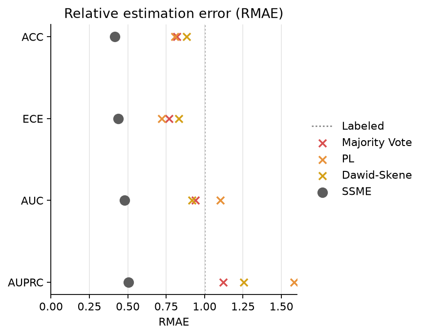
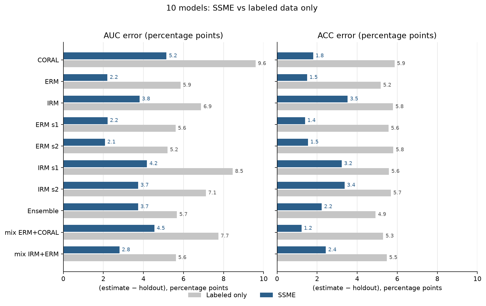

# SSME-Lite

Estimate Accuracy, AUC, AUPRC, and ECE for existing classifiers from a few true labels and their predicted probabilities. The package ranks those classifiers and writes an HTML report that opens offline.

The rendered results are at <https://jasonshen2002.github.io/ssme-lite/>. GitHub's file view shows the same HTML as source.

The method follows Shanmugam et al., *Evaluating multiple models using labeled and unlabeled data*, NeurIPS 2025. The official reference implementation is [divyashan/SSME](https://github.com/divyashan/SSME). EM runs for `max_iter` epochs. The default is 100, and with `early_stopping=False` those epochs all run. Pass a smaller `max_iter`, or set `early_stopping=True` to stop once the largest posterior change falls below `tol` (default `1e-3`). The default bandwidth is Scott. `bandwidth="official"` follows the public SSME code. The estimator does not guarantee a better estimate than the labeled-only baseline on every task.

## What this repository delivers

The course brief asks for an installable form of SSME: a prediction matrix, the estimator, a selection report, a transfer-learning example, and a comparison against labels alone. The last three rows are additions on top of the official research code.

| Piece | Role | Where |
| --- | --- | --- |
| Prediction matrix from sklearn-style models | Required | `PredictionMatrixGenerator` |
| SSME estimator | Required | `SSMEEstimator` |
| Ranks, intervals, and charts | Required | `report.save`, one offline HTML file |
| Few labels and many unlabeled samples | Required | CivilComments and PneumoniaMNIST, 20 visible labels |
| SSME versus labeled-only evaluation | Required | CivilComments figures below; PneumoniaMNIST 10-seed comparison |
| Docs and a runnable tutorial | Required | this README and the two notebooks |
| Transfer learning from a pretrained network | Required | frozen ImageNet ResNet18, then sklearn heads, in `experiments/transfer` |
| Model contribution | Added | `contribution=True` on both experiment reports |
| Installable package, parallel fits, one JSON config | Added | `pip install ssme-lite`, `n_jobs` for density updates and for seeds, `ssme-lite my_config.json` |
| Paper protocol, run by this package | Added | CivilComments half-split, 50 seeds, `bandwidth="official"`, 20 epochs |

Model contribution is the main addition. For each candidate, SSME is refit with that model removed. The visible labels, bandwidth, and epoch count stay fixed. The report shows how far the joint posterior moves, and how the other models' Accuracy estimates change. A larger move means that input carries information the others do not, so redundant models can be screened out. Both experiment pages include this section. On PneumoniaMNIST, removing `automl_vision_3` moves the unlabeled posterior most (mean total variation 0.028). On the CivilComments fit the posterior is already concentrated, so the largest move is `alg_IRM_seed1` at 0.000044.

`pip install ssme-lite` is the interface. Density updates and repeated seeds can run with `n_jobs`. A JSON config with a data path and a model list is enough for `ssme-lite my_config.json` to write the report.

## Install

```bash
pip install ssme-lite
```

From this repository:

```bash
pip install -e '.[dev]'
```

Transfer-learning experiments also need `pip install -e '.[transfer]'`. The core estimator does not depend on PyTorch.

## Usage

Start with classifiers that are already fit. They must share the same class set and implement `predict_proba`.

```python
from ssme_lite import PredictionMatrixGenerator, SSMEEstimator, SemiSupervisedSplit

generator = PredictionMatrixGenerator(models)
scores = generator.fit_transform(X)
splitter = SemiSupervisedSplit(n_labeled=20, n_unlabeled=400, random_state=0)
parts = splitter.indices(len(y))
y_partial = splitter.partial_labels(y, parts)

ssme = SSMEEstimator(max_iter=100, early_stopping=False, random_state=0)
ssme.fit(scores[parts["estimation"]], y_partial, model_names=generator.model_names_)
report = ssme.report(n_draws=100, primary_metric="auc", contribution=True)
print(report.ranking("auc"))
report.save("results/my_report")
```

`fit_transform` only collects probabilities. It does not train models. Binary `scores` have shape `(N, M)` and store the positive-class probability. Multiclass `scores` have shape `(N, M, K)`. `y_partial` is aligned row by row with the samples, and unknown labels are `-1`. Every class needs at least one visible label.

`report.save` writes a standalone `report.html`, plus `metrics.csv`, `metadata.json`, and `report_data.json`. Intervals on the page are latent-label uncertainty given the fitted posterior. They are not population sampling standard errors. `contribution=True` refits once with each model removed and records how that changes the joint posterior and the remaining Accuracy estimates. It costs one extra fit per model.

A probability matrix can also be passed without classifier objects. Put `scores` and `y` in an NPZ file, write a JSON config, and run `ssme-lite my_config.json`. The `configs/` directory in this repository holds synthetic data, a Gaussian diagnostic, and CivilComments and MultiNLI configs.

## CivilComments

This is the toxicity-detection task from the paper. Seven released classifiers are estimated from 20 visible labels and 1,000 unlabeled comments.

[experiments/civilcomments/quickstart.ipynb](experiments/civilcomments/quickstart.ipynb) fits one split and writes an offline report. The two figures below use this package's `SSMEEstimator` on the paper's half-split: 66,891 comments are the held-out ground truth, and each of 50 seeds draws 20 labels and 1,000 unlabeled comments from the other half with `SemiSupervisedSplit`. The fit is `bandwidth="official"` for 20 EM epochs. Regenerate them with `python experiments/civilcomments/reproduce_official_split.py`.

RMAE divides a method's held-out mean absolute error by the labeled-only error. The dashed line at 1 is that baseline. On these seeds, SSME's mean absolute error is 2.27, 2.12, 3.28, and 9.41 percentage points for Accuracy, ECE, AUC, and AUPRC. The corresponding RMAE is 0.41, 0.42, 0.47, and 0.42. Majority Vote, PL, and Dawid-Skene are the Appendix B.2 baselines, scored with this package's metrics. Accuracy and AUC are close to Tables S3 and S5 (2.34 and 3.34). ECE uses this package's equal-width bins, so it is not the paper's equal-frequency number.



Each bar is the mean absolute gap between the estimate and the holdout value, in percentage points. Smaller is better. The last three rows mix the released scores and are scored with the labels SSME imputes from the seven models.



The rendered report is <https://jasonshen2002.github.io/ssme-lite/experiments/civilcomments/civilcomments_report.html>. Opening the `.html` file on github.com shows the source. Its contribution section is filled: removing `alg_IRM_seed1` moves the posterior most, at mean total variation 0.000044.

## PneumoniaMNIST

This is the main experiment in the repository. Seven released PneumoniaMNIST classifiers are scored on the official test split, then estimated once with 20 visible labels and 400 unlabeled samples.

Open these two files to see the result without running inference:

- [experiments/pneumoniamnist/pneumoniamnist.ipynb](experiments/pneumoniamnist/pneumoniamnist.ipynb): the experiment steps and the AUC ranking for this estimate
- <https://jasonshen2002.github.io/ssme-lite/experiments/pneumoniamnist/pneumoniamnist_report.html>: the same interactive report. Opening the `.html` file on github.com shows the source.

To rerun the demo:

```bash
python experiments/pneumoniamnist/pneumonia_ssme.py
```

The three AutoML Vision weights are TFLite and need `pip install ai-edge-litert`. The 10-seed comparison against the labeled-only baseline is already in `experiments/pneumoniamnist/results/nl20_nu400_m7/`. On the estimation pool, mean absolute error for Accuracy falls from 0.058 with labels only to 0.021 with SSME. The report's contribution section is filled: removing `automl_vision_3` moves the posterior most, at mean total variation 0.028. Model selection and the protocol are in `experiments/pneumoniamnist/AUDIT.md`. The full write-up is `experiments/REPORT.md`.

## Transfer learning

This chain does not use the official checkpoints. A frozen ImageNet ResNet18 extracts features. Five sklearn heads are fit only on the official training split, then scored on the test split with the same `PredictionMatrixGenerator`, `SemiSupervisedSplit`, and `SSMEEstimator`.

```bash
pip install -e '.[transfer]'
python experiments/transfer/transfer_ssme.py
```

The repeated comparison is `python experiments/transfer/transfer_models.py --suite`. Any ImageFolder dataset can use `experiments/transfer/transfer_resnet.py`. See [experiments/README.md](experiments/README.md).

## Tests

```bash
python -m pytest -q
```

The tests cover probability alignment, the estimator, splits, report layout, and model contribution. Run them before a PyPI release.
